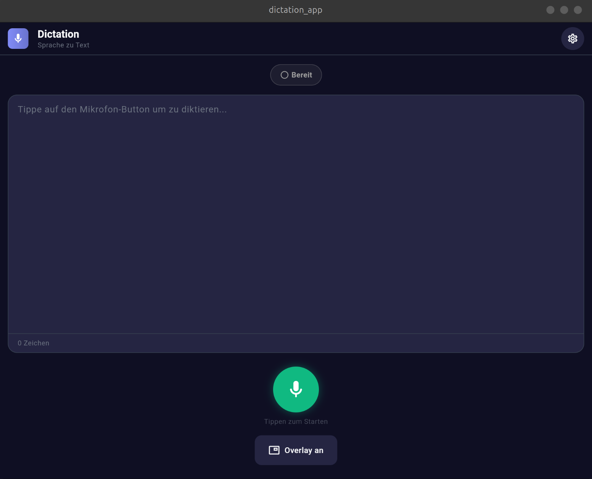
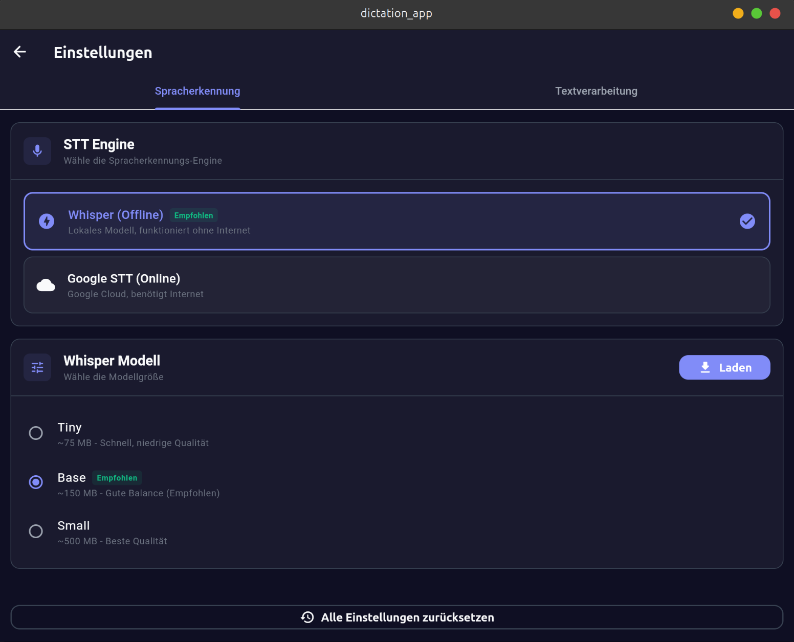

# Dictation App

A modern, offline-capable dictation application built with Flutter. It supports local speech-to-text using Whisper and AI-powered grammar correction via Ollama.

## Features

*   **Offline Speech-to-Text**: Uses OpenAI's Whisper model running locally on your device for high-accuracy transcription without internet.
*   **AI Grammar Correction**: Optional integration with Ollama to correct grammar and punctuation using local LLMs (e.g., Llama 3).
*   **Overlay Mode**: specialized overlay for easy dictation while using other apps (Android only).
*   **Modern UI**: Clean, responsive interface with dark/light mode support.
*   **Cross-Platform**: Built for Android, but supports Linux, Windows, and macOS.

## Screenshots

| Home | Settings |
|------|----------|
|  |  |

## Getting Started

### Prerequisites

*   **Flutter SDK**: >=3.10.0
*   **Ollama** (Optional): For grammar correction features. Ensure Ollama is running and accessible (default: `http://localhost:11434`).

### Installation

1.  Clone the repository:
    ```bash
    git clone https://github.com/yourusername/dictation_app.git
    cd dictation_app
    ```

2.  Install dependencies:
    ```bash
    flutter pub get
    ```

3.  Run the app:
    ```bash
    flutter run
    ```

### Whisper Models

The app uses `whisper_flutter_new` for on-device inference. You can download models (Tiny, Base, Small) directly within the app settings.

## Architecture

*   **State Management**: `flutter_bloc`
*   **Dependency Injection**: `get_it`
*   **Local Storage**: `shared_preferences`
*   **STT Engine**: `whisper_flutter_new` (Offline) or Google STT (Online)

## Project Structure

```
lib/
├── core/                   # Core functionality (DI, Services, Theme)
├── features/
│   ├── dictation/          # Main dictation feature
│   ├── overlay/            # Overlay window feature
│   ├── settings/           # App settings
│   └── spell_check/        # Grammar correction logic
└── main.dart               # App entry point
```

## Contributing

1.  Fork the repository
2.  Create your feature branch (`git checkout -b feature/amazing-feature`)
3.  Commit your changes (`git commit -m 'Add some amazing feature'`)
4.  Push to the branch (`git push origin feature/amazing-feature`)
5.  Open a Pull Request
